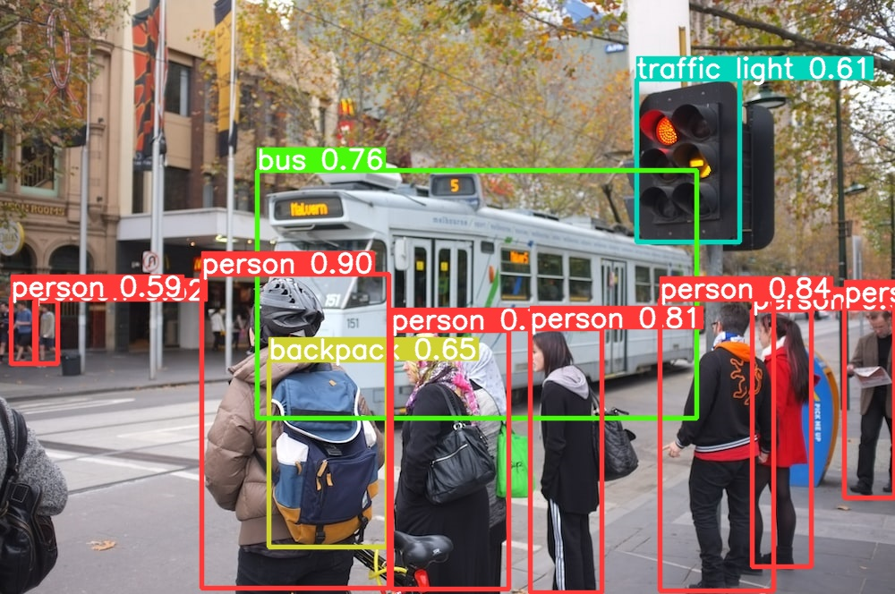

## Introduction
This repository supply a user-friendly interactive interface for [YOLOv8](https://github.com/ultralytics/ultralytics) with Object Tracking and Counting capability. The interface is powered by [Streamlit](https://github.com/streamlit/streamlit).

## Features
- Feature1: Object detection task.
- Feature2: Multiple detection models. `yolov8n`, `yolov8s`, `yolov8m`, `yolov8l`, `yolov8x`
- Feature3: Multiple input formats. `Image`, `Video`, `Webcam`
- Feature4: Multiple Object Tracking and Counting.

## Run online
You can use [This](https://yolov8-object-detection-a8pktamdkdeetfve67ruwr.streamlit.app/) link to try an online version on Streamlit.   

## Installation
### Create a virtual environment
```commandline
# create
python -m venv myenv

# activate
.\myenv\Scripts\activate
```

### Clone repository
```commandline
git clone https://github.com/iamakash-ai/YOLOv8-Object-Detection.git
```

### Install packages
```commandline
# YOLOv8 dependecies
pip install -r requirements.txt
```

## Run
```commandline
streamlit run app.py
```

## Result


  
